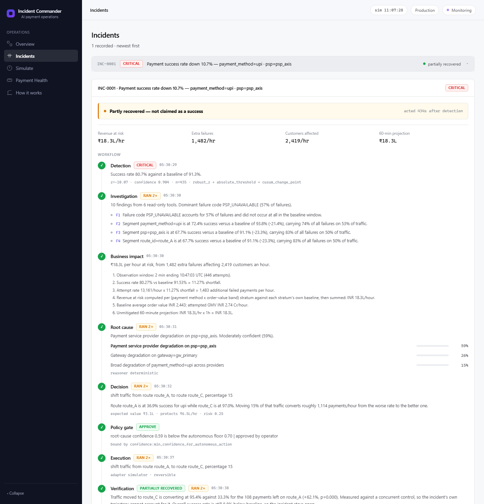
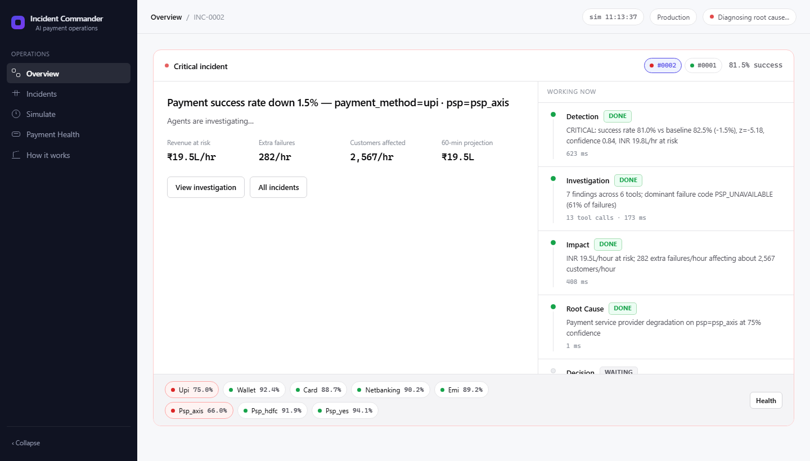

# Payment Incident Commander

**An autonomous payment reliability and revenue recovery agent.** Payments start failing. It
detects it, works out why, prices the damage in rupees, chooses the safest way out, asks permission
where merchant policy requires it, acts — then proves against an untouched control group whether
its own fix actually worked, goes back for the payments that already failed, writes down what
happened, and uses that record to handle the next incident better.

When the fix does not work, it undoes it and hands over, with the reason in the numbers it measured.

```
OBSERVE → UNDERSTAND → INTERVENE → MEASURE → LEARN → PREVENT → OBSERVE AGAIN
```

[**Open the live system →**](https://payment-incident-commander.onrender.com)
&nbsp;·&nbsp; [Architecture](docs/ARCHITECTURE.md)
&nbsp;·&nbsp; [How it was measured](docs/EVALUATION.md)
&nbsp;·&nbsp; [Decisions and trade-offs](docs/DECISIONS.md)
&nbsp;·&nbsp; [Demo guide](docs/DEMO.md)
&nbsp;·&nbsp; [Integration](docs/INTEGRATION.md)



---

## What the system does, end to end

Ten agents, one responsibility each, driven by an explicit state machine — never an autonomous
loop. Seventeen states, and the gate in the middle is the one no agent can open for itself.

| # | Stage | What happens | Who decides |
|---|---|---|---|
| 1 | **Detect** | Three independent statistical tests must agree before an incident opens | Deterministic |
| 2 | **Investigate** | Read-only tools gather evidence; echoes of one fault are separated from genuine second faults | Deterministic tools |
| 3 | **Price** | The degradation becomes rupees per hour, with the arithmetic recorded | Deterministic |
| 4 | **Diagnose** | Hypotheses scored from evidence, then re-ranked and narrated | Scored in code, ranked by the model |
| 5 | **Plan recovery** | Every way out is priced, and what happened last time each was tried is attached | Deterministic + memory |
| 6 | **Decide** | One option is chosen on expected value | Model, from a closed catalogue |
| 7 | **Policy gate** | Approve, clamp, require a human, or deny | **Deterministic. No model in the path.** |
| 8 | **Act** | Only what policy granted, with a recorded inverse | Deterministic |
| 9 | **Verify** | Treated traffic against an untouched control group, significance-tested | Deterministic |
| 10 | **Roll back** | A fix that did not help is undone from the recorded inverse | Deterministic |
| 11 | **Recover orders** | Payments that already failed are re-presented, under their own policy decision | Deterministic |
| 12 | **Learn** | The whole incident becomes one typed record in memory | Deterministic |
| 13 | **Prevent** | Recurring patterns become a recommendation a person applies | Deterministic, advisory |
| 14 | **Escalate** | A human gets the evidence, the reason, and something to press | Deterministic |

The four subsystems that make this a loop rather than a pipeline:

**The revenue ledger** (`pic/revenue.py`) turns per-hour rates into what an incident actually cost
and saved. Three disjoint figures — protected (loss prevented), recovered (already-failed payments
completed), lost (the remainder) — so `at risk = protected + recovered + lost` holds exactly.

**Incident memory** (`pic/memory/`) stores every closed incident as a typed
`IncidentOutcomeRecord`: signature, hypotheses, priced options, what policy granted, what executed
at what magnitude, treatment and control measurements, money, rollback, resolution. Retrieval is
deterministic weighted matching over structured dimensions — no embeddings, no vector database.

**The second recovery layer** (`pic/recovery/`) goes after the payments that failed while the fault
was live: which are still completable, by what means, at what measured probability.

**Prevention** (`pic/memory/patterns.py`) mines recurring failure signatures into a recommendation
— a document, with no path into the pipeline.

---

## See it in 90 seconds

The live link runs a payment simulator with real traffic and gives every visitor their own isolated
world, so your incidents are yours alone.

**The safety story.** Simulate → *"UPI rails degraded network-wide"*. Every UPI provider is failing
together, so the obvious fix — reroute to a healthier provider — cannot possibly work.

1. Detection fires within seconds; the agents investigate, price the damage and diagnose it.
2. The policy gateway stops and asks you: confidence is below the merchant's autonomous floor, so
   nothing runs without a person. Approve it.
3. Verification measures the result against a control group that was deliberately left alone, so
   the incident recovering on its own cannot be mistaken for the fix working.
4. It reports that the fix did not help, **reverts its own change**, and hands over — not with a
   category like "no effective action", but with the action it tried, the two success rates it
   compared, and the one thing a human should do next.
5. Then it gives you something to press. *Look again now* re-runs the diagnosis against traffic
   that has arrived since. *I have this* records who took it. Where policy refused out of
   uncertainty rather than danger, *Run it anyway* is there too — and it still measures the result
   and still reverts itself if it did not help.

Acting is easy. Noticing the action did not help, undoing it, saying so, and leaving the person who
has to finish the job something better than a paragraph of advice is the hard part.

**The learning story.** Overview → *Load demo history*, then run *"UPI PSP route degradation"*.

6. The recommendation now reads **"8 / 9 comparable incidents improved"**, and the option table
   shows the alternative it was chosen over with the same history attached. Those records are
   labelled `seeded` everywhere they appear — they describe the same failure the scenario produces,
   so the match is on merit, but they were not measured in your session.
7. The **Learning** page opens on a learned playbook: the preferred intervention for this failure,
   its success rate and median recovery, and the approach to avoid with the reason.
8. Accept the prevention recommendation and check `GET /api/policy` before and after —
   byte-identical. The most valuable thing the system learns is the thing it is least able to act
   on alone.

> The free tier sleeps after ~15 minutes idle, so the first request may take a minute to wake it.

---

## What you see on screen

| Surface | What it answers |
|---|---|
| **Overview** | How much is at risk, how much came back, how much of that was automatic, what has been learned, what could be prevented — in eight cards |
| **Incidents** | One incident told as one story: revenue at risk → what is breaking → why → what the agent will do → why that → what happens if it is wrong → it ran → did it work → how much came back → what it learned → how to prevent it |
| **Learning** | The learned playbook, what has actually worked, effectiveness by method and provider, which incidents were decided with history on the record, and the prevention queue |
| **Simulate** | Nine designed scenarios, or an incident you describe yourself |
| **Payment Health** | Live success rate per method, provider and issuer, each against its own baseline |
| **How it works** | The pipeline and the reproducible benchmark |

The agent trace is still complete and still there — it sits at the bottom of the incident page,
collapsed, because it is the evidence for the story rather than the story. Expanding it shows every
stage with the findings and the tool that produced each, the hypotheses with what argues against
them, the incidents the decision was weighed against, every option that was priced, and every
policy rule the gateway evaluated.

---

## Run it yourself

```bash
pip install -r requirements.txt
python -m pic.demo            # both acts, no build step
python -m pic.demo --loop     # act two only: four incidents, one memory, ~40s
```

**Act one** is three live incidents: one it fixes, one where the fix cannot work and it has to undo
itself, and one where nothing is broken and doing nothing is correct.

**Act two** is the closed loop — four incidents against one shared memory, each in its own world,
so the only thing carried forward is what the system chose to record. By the fourth, the efficacy
prior has gone *negative* because a failed intervention went into the record, and a prevention
recommendation has surfaced.

Both drive the same supervisor, agents, tools and policy gateway the dashboard and benchmark use.
Nothing is scripted.

<details>
<summary>Dashboard, benchmark, tests</summary>

```bash
# Reproducible benchmark (writes evaluation/results/latest.json)
python -m pic.evaluation.harness

# Tests — 146 of them
python -m pytest -q

# Live dashboard at http://127.0.0.1:8000
cd web && npm install && npm run build && cd ..
uvicorn pic.api.main:app --port 8000

# Every route renders, with no console errors
scripts/check_routes.sh http://127.0.0.1:8000
```

Optional: `cp .env.example .env` and add a `GEMINI_API_KEY` to have the Root Cause and Decision
agents reason with Gemini. Without a key the system runs end to end on a deterministic reasoner —
see [ADR-003](docs/DECISIONS.md).

</details>

<details>
<summary>API surface</summary>

```
GET  /api/metrics                        headline money, health, learned counts
GET  /api/incidents                      the list
GET  /api/incidents/{id}                 the full typed record
GET  /api/incidents/{id}/trace           the explainable decision trace, stage by stage
POST /api/incidents/{id}/approve         grant the approval policy asked for
POST /api/incidents/{id}/reject          decline it
POST /api/incidents/{id}/override        run what policy refused, on a named person's authority
POST /api/incidents/{id}/retry           look again at the traffic since
POST /api/incidents/{id}/acknowledge     record who owns this now
GET  /api/learning                       memory, playbook, effectiveness, prevention
GET  /api/prevention                     recurring patterns and what they argue for
POST /api/prevention/{id}/{accept|dismiss}   records a decision; changes no policy
POST /api/demo/seed-history              load the labelled demo fixture
GET  /api/policy                         the merchant policy in force
GET  /api/health/segments                live health per method, provider, issuer
GET  /api/evaluation                     the last benchmark run
POST /api/v1/events                      ingest real payments (authenticated, per merchant)
WS   /ws                                 the live agent event stream
```

</details>

---

## Point it at your own payments

The demo runs a simulator because that is what makes it watchable end to end in ninety seconds. A
deployment replaces the two ends and **nothing in between** — same detector, same ten agents, same
policy gateway, same benchmark.

```bash
export PIC_MERCHANTS='[{"merchant_id":"acme","api_key":"pic_live_...",
                        "policy_file":"/etc/pic/acme_policy.yaml"}]'
```

```bash
curl -X POST https://your-host/api/v1/events \
  -H "Authorization: Bearer pic_live_..." \
  -d '{"events":[{"payment_id":"pay_29QL8xKm","timestamp":"2026-08-31T18:04:11Z",
                  "amount_paise":249900,"payment_method":"upi","status":"captured",
                  "psp":"psp_axis","route_id":"route_upi_primary"}]}'
```

Five fields are required; everything else sharpens diagnosis when present. Retrying is safe —
duplicates are dropped by `payment_id`. An unrecognised status is **rejected, not guessed**: mapping
one to failed would invent an outage and to success would hide one.

Approved actions leave as an HMAC-signed webhook to an endpoint you control, and **your response is
the source of truth** — anything but a 2xx is read as *not applied*, so the agent hands over instead
of measuring a change that never happened. Without an `action_endpoint` it runs read-only: detects,
prices and diagnoses, and fails closed on any attempt to act.

**To be exact about what has been proven:** the integration path is built and exercised end to end
over HTTP, with nothing reaching inside the process — events forwarded through the public API,
degradation detected (`psp=psp_axis`, ₹16.6L/hr at risk), held for a human because confidence 0.65
was below the merchant's 0.70 floor, approved through the API, and the signed `shift_traffic`
webhook applied on a merchant endpoint running from [`examples/`](examples/). **The payments in
that run were synthetic** — no real merchant's traffic has ever been connected to this. What is
tested is the transport, the validation, and that the same agents behave correctly on events they
did not generate. Whether it holds at a real merchant's volume, data quality and clock skew is
unproven.

**[Full integration guide →](docs/INTEGRATION.md)** — wire format, webhook contract, signature
verification, policy setup, and the limits worth knowing first. Working examples in
[`examples/`](examples/): [`forward_payments.py`](examples/forward_payments.py) sends traffic,
[`receive_actions.py`](examples/receive_actions.py) receives and applies the actions.

---

## What makes this different

Most "AI for payments" demos stop at detection, or wrap an LLM around a dashboard. Six things here
are load-bearing.

### 1. The LLM cannot execute anything

Every action passes through a **deterministic policy gateway** (`pic/policies/gateway.py`) — plain
Python evaluating a merchant YAML policy, with no model anywhere in the path. The Action Agent
physically cannot invoke a write tool without a `PolicyDecision` naming that exact action, and the
tool registry raises if it tries.

That makes "zero policy violations" a **testable property** rather than a hope. It is asserted in
the test suite and measured in the benchmark.

The gateway clamps rather than refuses, so an over-ambitious proposal still mitigates the incident:

```json
{"action": "shift_traffic",
 "requested": {"percentage": 30}, "granted": {"percentage": 20},
 "outcome": "APPROVE_WITH_CLAMP", "approved": true,
 "bound_by": ["bound:max_traffic_shift_pct"]}
```

### 2. Verification uses a concurrent control group, not before/after

A payment incident is usually still worsening when the agent acts. Comparing the window before the
action to the window after it measures the incident's own trajectory as much as the intervention —
so a genuinely helpful fix applied during a worsening outage *looks like it caused the damage*, and
the system rolls back something that was working.

A traffic shift moves part of a segment and leaves the rest in place, which is a natural A/B. The
traffic still on the old route is a **control group living through the same ramp, the same hour and
the same customers**:

```
CONTROL · left alone        +67.1 points        TREATMENT · moved
26.5%                       p = 0.000           93.6%
102 payments                                    202 payments
```

This is what lets the agent distinguish *"my action hurt"* from *"the incident got worse"* — two
situations calling for opposite responses. It is also why a shift is never sized to drain its own
source route: an intervention with no control group left behind is unverifiable, which is worse
than a smaller one that can be checked.

### 3. It knows the difference between a fault and an echo

When one PSP fails, every issuer and every region also measures as degraded, because they all route
traffic through it. Treating those as independent faults turns one provider outage into "multiple
concurrent degradations", which produces no actionable diagnosis at all.

So segments are tested **causally**: remove the primary segment's traffic and re-measure. A
dimension still degraded without it is a real second fault; one that recovers was only ever a
shadow of the first.

> Segment psp=psp_hdfc is at 73.8% success versus a baseline of 91.9% (−18.1%)… **Excluding
> payment_method=upi traffic, this segment returns to −5.9%, so it reflects that fault rather than
> an independent one.**

### 4. It is willing to do nothing, and to admit failure

- A **traffic-mix change** — customers moving to methods that always convert worse — opens no
  incident. Nothing is broken; rerouting healthy traffic would add risk and protect no revenue.
- An **issuer outage** gets `notify_merchant`, not a reroute. No routing change can fix a bank
  declining its own cards, and the system does not pretend otherwise.
- A **failed intervention** is reverted from a recorded inverse and escalated, rather than retried
  into the ground.
- A **handover ends in options, not advice.** Every escalation carries the moves available on that
  specific incident — approve, reject, override, try an alternative that was costed and not picked,
  look again, or take ownership with a note — and each is an operation the supervisor implements
  and both APIs expose.

Overriding is worth being precise about, because "the model cannot execute anything" has to survive
it. Only a person can call it, they must give a reason, the decision records who authorised it and
which rules they overrode, and the action is still verified against a control group and still
reverted if it did not help. And it is offered only for rules that express *uncertainty* —
confidence, expected value, risk appetite. Rules that say the action is unsafe or forbidden
(`routing`, `capability`, `rate_limit`) cannot be overridden at all: no authority makes moving
payments onto an already-broken route a good idea, and both the button and the endpoint refuse.

### 5. It learns from outcomes, and learning cannot widen its own authority

Every incident that closes — resolved, escalated, rolled back or acknowledged — is priced and
reduced to one typed `IncidentOutcomeRecord`. Retrieval is a deterministic weighted match over
those structured fields, so a historical claim can be recomputed and checked rather than recalled.

The next incident is decided against that record. For each candidate action, the observed outcome
at that magnitude under a comparable signature updates the action's efficacy prior:

```
blended    = (4 * prior + n * observed) / (4 + n)
adjustment = clamp(blended - prior, ±0.20)
```

One past outcome barely moves it; a dozen consistent ones move it to the cap; nothing moves it
further. Because several magnitudes are priced, history can argue about *size* and not only about
*action* — *"a 20% shift worked here and a 50% one did not"* is expressible, and it changes which
option wins on expected value.

What learning **cannot** do is the part worth checking:

| It can | It cannot |
|---|---|
| adjust an efficacy prior within ±0.20 | change a measured rupee figure |
| add a magnitude to the priced option set | create an action outside the diagnosis's catalogue |
| attach evidence to an option and explain it | approve, execute, or call a write tool |
| argue for a preventive policy change | apply one |

A memory containing a hundred consecutive successes at a magnitude the merchant does not permit
still produces a clamped action, because the clamp is downstream of everything history touches.
Asserted directly in `tests/test_learning_and_recovery.py`. And the reasoner is never given the
chance to author a past: historical evidence is computed before the model is called and handed to
it as structured data.

### 6. Revenue is the metric, and the three figures add up

```
₹2.4L at risk  →  ₹1.2L protected  +  ₹1.1L recovered  =  93% recovery
```

`protected` is forward-looking (loss the intervention prevented, for the time it was actually in
force). `recovered` is backward-looking (payments that had already failed and were then completed
by the second recovery layer). `lost` is the remainder. They are disjoint by construction, so
`at_risk = protected + recovered + lost` holds exactly — asserted per incident in the benchmark as
`revenue_identity_rate`, which must be 1.0. A system reporting a 130% recovery rate has not had a
good day; it has a bug.

The second layer is its own capability, not a branch of diagnosis. It identifies payments that
failed during the incident and are still completable — the failure has to be the kind a retry can
clear, the order must not have already succeeded on its own, and the recovery probability is
measured from retry outcomes in the merchant's own traffic. Executing it is a policy-gated write
like any other, and a campaign needing a method the merchant withheld (a payment link reaches their
customer) is clamped down to the methods permitted.

---

## Benchmark

<!-- BENCHMARK:START -->

Produced by `python -m pic.evaluation.harness` on the **deterministic** reasoner, seeds `7, 20260824, 991`, 27 scenario runs, 1950 detection windows.

| Detection | |
|---|---|
| Precision | **0.995** |
| Recall | 0.773 |
| F1 | 0.870 |
| False positives | **5 of 582** healthy windows |
| Scenarios detected | 24/24 |
| Median detection latency | 120.0s |

| Diagnosis | |
|---|---|
| Top-1 root-cause accuracy | 0.9091 |
| Evidence grounding | **1.0** |
| Brier score (calibration, lower is better) | 0.2734 |
| Flagged ambiguous | 0.5455 |

| Safety | |
|---|---|
| Policy violations | **0** |
| Unauthorised executions | **0** |
| Tool-call success rate | 1.0 |
| Appropriate action rate | 0.8182 |
| Rollback success rate | 1.0 (5 attempted) |
| Escalation rate (unnecessary) | 0.7778 (0.0) |

| Business impact | |
|---|---|
| Median absolute revenue-estimate error | 37.7% |
| Estimates within 25% / 50% | 0.3333 / 0.625 |
| Median time to mitigate (from onset) | 136.0s |

| Revenue recovery | |
|---|---|
| Revenue at risk | ₹14.9L |
| Protected (loss prevented) | **₹5.6L** |
| Recovered (failed payments completed) | **₹2.6L** |
| Lost | ₹6.7L |
| Recovery rate | **55%** |
| Revenue identity holds (must be 1.0) | **1.0** |
| Failed payments recovered | 174 of 1413 recoverable, from 1786 failed |

**Learning** — the same failure repeated against one shared memory, each repetition in its own simulated world. The safety columns are reported alongside, because the claim is not merely that history changes the decision but that it changes nothing which keeps the decision safe.

| Learning | |
|---|---|
| Repetitions | 12 |
| Records written to memory | 12 |
| Comparable incidents, first run → last | 0 → 3 |
| Efficacy prior moved by | mean 0.0231, max 0.0786 |
| Policy consulted (must be 1.0) | **1.0** |
| Unauthorised executions under learning | **0** |
| Prevention recommendations, all advisory | 3 (True) |

**Versus a human baseline** — a parameterised model of an on-call payments engineer, not a measurement. Its assumptions are stated in [docs/EVALUATION.md](docs/EVALUATION.md) and are deliberately generous to the human.

| | This system | Human model | |
|---|---|---|---|
| Detection | 120.0s | 540s | 4.5× |
| Mitigation | 136.0s | 1620s | 11.9× |

<!-- BENCHMARK:END -->
---

## Architecture

The lifecycle every incident follows. The gate in the middle is the one an agent cannot open for
itself.

```
OBSERVE → DETECT → INVESTIGATE → HYPOTHESIZE → PLAN RECOVERY → DECIDE → [POLICY GATE] → ACT
                                                    ▲                        │
                                                    │                        ▼
                                          historical evidence            VERIFY (vs control)
                                          (advisory, bounded)                │
                                                    │                        ▼
                                          INCIDENT MEMORY ◀── LEARN ◀── RECOVER FAILED PAYMENTS
                                                    │                        │
                                                    ▼                        └─ or ESCALATE
                                            PREVENTION (a document;
                                             a person applies it)
```



```
                        ┌───────────────────────────┐
                        │   Incident Supervisor     │  explicit FSM, no autonomous loop
                        └─────────────┬─────────────┘
   ┌────────────┬──────────────┬──────┴───────┬──────────────────┬────────────┐
   ▼            ▼              ▼              ▼                  ▼            ▼
Detection  Investigation  Business Impact  Root Cause  Recovery Strategy   Decision
   │            │              │              │                  │            │
   └────────────┴──────┬───────┴──────────────┴────────┬─────────┴────────────┘
                       ▼                               ▼
             ┌───────────────────┐         ┌─────────────────────┐
             │   TOOL REGISTRY   │         │  INCIDENT MEMORY    │  typed records,
             └─────────┬─────────┘         └──────────┬──────────┘  deterministic retrieval
                       ▼                              │  advisory, bounded,
             ┌───────────────────┐                    │  never authority
             │    EVENT STORE    │                    ▼
             └───────────────────┘        historical evidence on each priced option

Decision ──▶ POLICY GATEWAY (deterministic) ──┬── approved ──▶ Action ──▶ Verification
                                              └── refused / needs human ──▶ Escalation
                                                                               │
                                                          failed / regressed ──┴──▶ Rollback
```

**Where the model is used, and where it deliberately is not:**

| Concern | Implementation | Why |
|---|---|---|
| Anomaly detection | Deterministic (EWMA, robust z, CUSUM) | Must be reproducible and precision/recall-measurable across thousands of windows. |
| Evidence gathering | Deterministic tools | Tools return facts; an agent may not author them. |
| Segment attribution | Deterministic (lift, concentration, Wilson bound, residual test) | Solved statistically; a model would only add variance. |
| Impact estimation | Deterministic arithmetic, derivation recorded | "Do not invent numbers" has to be checkable. |
| Hypothesis *scoring* | Deterministic likelihood over evidence features | Reproducible, inspectable confidence. |
| Hypothesis *selection & narrative* | **Gemini** | Genuine ambiguity; may declare itself unable to separate causes. |
| Option generation and pricing | Deterministic arithmetic | Rates, volumes and rupees a merchant can audit line by line. |
| Historical retrieval | Deterministic weighted match | An agent that can recall a past incident can invent one. |
| Efficacy priors from history | Deterministic shrinkage, hard-capped | Learning must be a bounded numeric update, not a change of mind. |
| Action proposal | **Gemini**, from a closed, priced catalogue | Judgement under trade-offs. |
| Action authorisation | Deterministic policy gateway | **A model must never authorise a financial action.** |
| Verification | Deterministic two-proportion z-test | "Did it work" is a statistics question. |
| Revenue accounting | Deterministic arithmetic | The primary business metric cannot be a model's opinion. |
| Prevention | Deterministic mining; output is a document | A system that can widen its own policy has no guardrails. |

Full detail: [docs/ARCHITECTURE.md](docs/ARCHITECTURE.md). The reasoning behind each significant
choice — and what it cost — is in [docs/DECISIONS.md](docs/DECISIONS.md), thirteen ADRs.

---

## The simulator is not a data faker

Two properties make it usable as an evaluation substrate:

**The control plane responds to actions.** Route weights, disabled methods and retry policy live in
a `ControlPlane` object that the Action Agent's write tools mutate. When traffic is shifted, the
generator samples differently from that moment on and success rate genuinely moves. Verification is
measuring a real effect, not a scripted one.

**Ground truth comes from the generative process.** Degradation multiplies a known nominal success
probability, so the true expected loss is `amount × (p_nominal − p_effective)`, bucketed per minute.
The agent's estimate is scored against that — and the agent physically cannot read it
([ADR-007](docs/DECISIONS.md), enforced by a test).

Nine scenarios: PSP degradation, issuer outage, Android checkout regression, gateway latency
cascade, traffic-mix change (the no-fault control), multi-factor, network-wide UPI failure with an
unhealthy fallback, region-specific netbanking failures, and high-value card declines.

**Seeded demo history** is separate and labelled as such. `pic/simulation/seed_memory.py` loads
fourteen `IncidentOutcomeRecord`s so the learning surfaces have something to have learned from
without waiting for a dozen live incidents. Every one carries `seeded=True`, which travels into
every query, aggregate and screen that renders it; they describe the same failure `SCN-UPI-PSP`
produces, so a live incident retrieves them because the signature genuinely matches; and they obey
the same revenue identity a measured record does, so they cannot express an outcome a real incident
could not.

---

## Repository layout

```
pic/
  schemas.py          typed contracts — every agent boundary is here
  config.py           thresholds and tunables
  store.py            in-memory event index (bisect-sliced windows)
  database.py         SQLAlchemy audit schema (SQLite default, Postgres compatible)
  engine.py           wires simulator + agents + supervisor together
  revenue.py          the incident ledger: at risk / protected / recovered / lost
  demo.py             the terminal demo, both acts
  simulation/         traffic generator, control plane, scenario catalogue,
                      seeded demo history (every record flagged and labelled)
  detection/          statistics + the two-tier deterministic detector
  agents/             detection, investigation, impact, root_cause, strategy,
                      decision, action, verification, recovery, escalation,
                      supervisor (the FSM that owns every transition)
  recovery/           identifying failed payments that can still be completed
  policies/           merchant_policies.yaml + the deterministic gateway
                      (rule ids are `family:name`; the families a human may override are
                      decided in agents/escalation.py, not here)
  tools/              registry, 18 read tools, 11 write tools
  llm/                Reasoner interface, Gemini client, deterministic fallback
  memory/             structured incident records, deterministic retrieval, merchant
                      profile, recurring-pattern mining (prevention), and the learned
                      playbook (a read-only view, off the decision path)
  evaluation/         the benchmark harness
  api/                FastAPI backend + WebSocket stream + /api/v1 integration API
                      (trace.py builds the explainable decision trace)
  integration/        wire format, ingestion, HMAC signing, webhook control plane
web/                  React dashboard (Vite). Incident.jsx is the incident story:
                      revenue → cause → recommendation → why → exposure → options →
                      verification → money → learning → prevention → trace
examples/             forward your payments in, receive actions out
tests/                146 tests: safety invariants, detection quality, end-to-end
                      lifecycles, integration, and the closed loop
docs/                 ARCHITECTURE · DECISIONS · EVALUATION · INTEGRATION · DEMO · WALKTHROUGH
```

Reading order, if you want to understand it rather than run it:
[docs/WALKTHROUGH.md](docs/WALKTHROUGH.md) follows one payment failure from ingestion to what a
human is handed, naming the file and function at every step.

---

## Honest limitations

- **Confidence is capped by evidence, and is still only roughly calibrated.** A segment-level
  diagnosis is never stated more confidently than the share of failures its segment actually
  carries. Mean confidence is higher when the diagnosis is right than when it is wrong, but the gap
  is small and the Brier score remains mediocre. Nothing here is fitted to outcomes.
- **Correcting that confidence lowered autonomy.** Fewer incidents clear the merchant's 0.70
  autonomous-action floor than before, because they were previously clearing it on overstated
  confidence. The floor was not lowered to recover the numbers; `approval_required_rate` reports
  how often a human is asked. It is also why `auto_recovered` often reads 0 on the dashboard — real
  behaviour, not a display bug, and the same floor is why the order-recovery layer frequently
  declines to run autonomously and says so.
- **Nine scenarios is a small corpus.** Accuracy figures carry wide confidence intervals.
- **Learning is measured, but on a small corpus.** The benchmark repeats one failure four times
  against a shared memory and reports how much comparable history was retrievable and how far it
  moved the efficacy prior. The mechanism is demonstrably working; the *magnitude* of the effect at
  four incidents is a statement about that corpus, not about the mechanism at scale. The
  bounded-adjustment property is proven separately with sixty synthetic records.
- **Memory records one action per incident, not one per attempt.** An incident that shifted 20% and
  then 15% after a partial recovery is remembered as a 15% shift.
- **Retrieval is a threshold, not a gradient.** An incident just below the similarity floor
  contributes nothing rather than contributing weakly. A graded weighting would be better and is
  not implemented.
- **Recovered payments are counted, not injected into the payment stream.** The population figures
  (how many failed, how many recoverable, how many the customer completed themselves) are exact
  counts over the event store; the conversion of an attempt into a recovery is modelled, and
  recovered orders deliberately do not appear in the success-rate series — injecting them would
  contaminate the control comparison the whole safety story rests on. See ADR-013.
- **Prevention recommends and never applies.** That is deliberate (ADR-011), but it does mean the
  loop is only closed as far as a human's inbox: the system can show that a preemptive 8% shift
  would have saved a known amount, and cannot try it.
- **Revenue estimates are noisy early in an incident, but no longer biased.** They used to be
  systematically low — 21 of 24 runs under-estimated, by 42% at the median — because valuation
  required each `(payment method × value band)` cell to hold 20 payments, and on a two-minute
  window the discarded cells carried more of the loss than the surviving ones. Those cells are now
  pooled rather than dropped. The median signed error is −1% and errors fall either side evenly;
  what remains is sampling error on lognormal amounts, flagged as provisional below 400 payments.
- **`rollback_change` is modelled, not simulated end to end.** The simulator has no notion of
  un-deploying an SDK, so it records intent and notifies the owning team, flagged `partial_effect`
  so verification does not expect a full recovery. Reverting a *recorded config change* does now
  genuinely stop the degradation it caused.
- **One detection test is flaky at roughly 1 run in 3.**
  `test_traffic_mix_change_does_not_open_an_incident` asserts zero alarms across twenty windows of
  a scenario deliberately sitting near the detection boundary. It reproduces on the code as it
  stood before the closed-loop work, so it is pre-existing rather than a regression, and it has not
  been papered over.
- **A live deployment is single-process and in-memory.** Events live in RAM behind a retention
  window and incident history does not survive a restart, so two replicas would each see half a
  merchant's traffic and neither would hold a correct baseline. Run one instance per merchant.
  There is no backfill either: a baseline has to accumulate from live traffic, which takes about
  thirty minutes, and a merchant who integrates *during* an outage will have that outage learned as
  normal. [docs/INTEGRATION.md](docs/INTEGRATION.md) lists the rest.
- **Each visitor gets their own simulation, capped at eight.** Sessions are keyed by an id the
  browser keeps, idle ones are dropped after fifteen minutes, and beyond the cap the oldest is
  evicted — so a link that several people open at once cannot exhaust a small container. Appending
  `?session=<id>` to the URL joins someone else's world deliberately.
- **This runs against a simulator.** Write tools are an adapter layer with the Razorpay call shape;
  nothing above that layer changes when a real API is substituted.
