# The project map — what is happening, and where

This document answers one question: **if something is happening in this system, which file is doing
it?**

The other documents each take one cut. [ARCHITECTURE](ARCHITECTURE.md) is the contract,
[DECISIONS](DECISIONS.md) is why each part is shaped as it is, [WALKTHROUGH](WALKTHROUGH.md)
follows a single payment failure through the code, [EVALUATION](EVALUATION.md) is how well it
works, [INTEGRATION](INTEGRATION.md) is how to point it at a real merchant, and [DEMO](DEMO.md) is
how to show it.

This one is the index. Every subsystem, every file, every screen, and what produces what.

---

## 1. The shape of it

```
                     PAYMENTS
       simulator  ──────┬────── or real traffic via POST /api/v1/events
                        ▼
                   EVENT STORE                       pic/store.py
                        ▼
                    DETECTOR                         pic/detection/
                        ▼
              INCIDENT SUPERVISOR  ◀── the FSM; owns every transition
                        │                            pic/agents/supervisor.py
     ┌──────────────────┼──────────────────┐
     ▼                  ▼                  ▼
  10 AGENTS       TOOL REGISTRY      INCIDENT MEMORY
  pic/agents/     pic/tools/         pic/memory/
                        │                  │
                        ▼                  │ advisory, bounded,
                  READ / WRITE tools       │ never authority
                        │                  ▼
                        │        historical evidence on each priced option
                        ▼
                 POLICY GATEWAY   ◀── deterministic, no model in the path
                 pic/policies/                        │
                        │                             │
            approved ───┴─── refused / needs a human ─┴──▶ ESCALATION
                        ▼
                  CONTROL PLANE    simulator, or your stack over signed HTTP
                        ▼
                  VERIFICATION     treatment vs an untouched control
                        ▼
              REVENUE LEDGER  →  LEARNING  →  PREVENTION
              pic/revenue.py     pic/memory/   (a document a person applies)
                        ▼
                   FASTAPI + WEBSOCKET          pic/api/
                        ▼
                   REACT DASHBOARD              web/src/
```

Two rules that the whole design hangs off, and where each is enforced:

| Rule | Enforced in |
|---|---|
| The model can propose but never execute | `pic/policies/gateway.py`, `pic/tools/registry.py::call` |
| History is evidence, never authority | `pic/agents/strategy.py` (bounded prior), asserted in `tests/test_learning_and_recovery.py` |

---

## 2. Every directory, and what lives in it

### `pic/` — the system

| Path | Lines | What it does |
|---|---:|---|
| `pic/schemas.py` | 907 | **Every typed contract.** If it crosses an agent boundary or gets persisted, it is defined here and nowhere else. |
| `pic/config.py` | 186 | Thresholds and tunables — detection windows, verification significance, speed-up factors. |
| `pic/engine.py` | 411 | Wires simulator + store + detector + tools + gateway + memory + supervisor. The demo, the API and the benchmark all construct through this, so none of them can diverge. |
| `pic/store.py` | 497 | In-memory event index. Timestamp-sorted with a parallel epoch array, so a window slice is a bisect not a scan. |
| `pic/database.py` | 272 | SQLAlchemy audit schema — incidents, agent steps, tool calls, policy decisions, audit records, incident memory, prevention. SQLite by default. |
| `pic/revenue.py` | 169 | **The money.** Turns per-hour rates into what an incident cost and saved, with the identity `at risk = protected + recovered + lost` true by construction. |
| `pic/demo.py` | 634 | The terminal demo, both acts. |

### `pic/agents/` — one responsibility each

| File | Lines | Owns | Produces |
|---|---:|---|---|
| `pic/agents/supervisor.py` | 1126 | **The FSM.** Every state transition, the intervention cap, the clock, learning at close. | — |
| `pic/agents/base.py` | 172 | The agent contract: timing, tool-call capture, failure containment, step recording. | `AgentStep` |
| `pic/agents/detection.py` | 30 | Wraps the detector as an agent. | `AnomalySignal` |
| `pic/agents/investigation.py` | 783 | Evidence gathering, and separating real second faults from echoes of the first. | `EvidenceBundle` |
| `pic/agents/impact.py` | 136 | Prices the degradation per hour, showing every step of the arithmetic. | `ImpactAssessment` |
| `pic/agents/root_cause.py` | 570 | Scores hypotheses from evidence features; the model may re-rank but never invent. | `RootCauseAssessment` |
| `pic/agents/strategy.py` | 968 | **Prices every way out**, at several magnitudes, and attaches what happened last time each was tried. | `RecoveryPlan` |
| `pic/agents/decision.py` | 180 | Chooses one priced option on expected value. Cannot generate options. | `ActionProposal` |
| `pic/agents/action.py` | 250 | The only agent that calls a write tool, and only with a decision naming that action. Writes the audit record with its inverse. | `ActionResult`, `AuditRecord` |
| `pic/agents/verification.py` | 438 | Treatment against a concurrent control, significance-tested. | `VerificationResult` |
| `pic/agents/recovery.py` | 214 | The second layer: payments that already failed, under their own policy decision. | `OrderRecoveryResult` |
| `pic/agents/escalation.py` | 466 | Hands over with the case, not the category, and a list of moves a human can actually make. | `Escalation` |

### `pic/detection/` — why detection is not an LLM

| File | Lines | What |
|---|---:|---|
| `pic/detection/detector.py` | 512 | Two-tier detector: a fast headline tier and a slower segment tier that catches what the headline hides. Three tests must agree. |
| `pic/detection/statistics.py` | 163 | EWMA baseline, robust z-score, CUSUM change point, two-proportion z-test, Wilson bounds. |

### `pic/memory/` — the closed loop

| File | Lines | What |
|---|---:|---|
| `pic/memory/store.py` | 664 | Storage and deterministic retrieval. `find_similar_incidents`, `get_success_rate_for_action`, `get_action_outcomes_for_condition`, `get_historical_recovery_outcomes`. Merchant-scoped by default. |
| `pic/memory/build.py` | 216 | **The only writer of memory.** Copies fields from typed agent outputs; no model on the path. |
| `pic/memory/playbook.py` | 360 | The between-incidents view: preferred intervention per signature, what to avoid, effectiveness by method and provider. **Read-only, off the decision path.** |
| `pic/memory/patterns.py` | 240 | Mines recurring signatures into `PreventionRecommendation`s. Recommends; cannot apply. |
| `pic/memory/profile.py` | 216 | Merchant operating profile, derived from their policy and their own outcomes. No hand-written preferences. |

### `pic/policies/` — the gate

| File | Lines | What |
|---|---:|---|
| `pic/policies/gateway.py` | 551 | Deterministic rule evaluation. Most restrictive outcome wins, clamp before refusing, unknown means no. |
| `pic/policies/merchant_policies.yaml` | — | The merchant's standing grant of authority. Data, not code. |

### `pic/tools/` — every fact comes from here

| File | Lines | What |
|---|---:|---|
| `pic/tools/registry.py` | 164 | Typed registration, call recording, and the gate: a write tool without an approving decision **raises**. |
| `pic/tools/read_tools.py` | 620 | 18 read tools. Pure functions of the store and a window. |
| `pic/tools/write_tools.py` | 410 | 11 write tools. The only side-effecting code, each with a declared inverse. |

### `pic/recovery/`, `pic/simulation/`, `pic/llm/`, `pic/api/`, `pic/integration/`, `pic/evaluation/`

| File | Lines | What |
|---|---:|---|
| `pic/recovery/orders.py` | 186 | Which failed payments are still completable, by what means, at what measured probability. |
| `pic/simulation/generator.py` | 654 | Traffic generator and the `ControlPlane` the write tools mutate. Ground truth accumulates from the generative process. |
| `pic/simulation/scenarios.py` | 328 | Nine injectable degradations with known ground truth. |
| `pic/simulation/seed_memory.py` | 195 | Deterministic seeded history. Every record flagged `seeded=True`. |
| `pic/llm/base.py` | 97 | The reasoner interface — three narrow methods, deliberately. |
| `pic/llm/gemini.py` | 352 | Gemini client, with validation against the evidence bundle and catalogue. |
| `pic/llm/deterministic.py` | 100 | The fallback that makes the repo run with no credentials. |
| `pic/api/main.py` | 883 | FastAPI backend, per-visitor simulation sessions, WebSocket stream. |
| `pic/api/trace.py` | 462 | Builds the explainable decision trace, stage by stage. |
| `pic/api/v1.py` | 237 | The authenticated integration API for real merchants. |
| `pic/integration/ingest.py` | 103 | Validating real payment events; unknown status is rejected, not guessed. |
| `pic/integration/control.py` | 242 | The webhook control plane. The merchant's response is the source of truth. |
| `pic/integration/signing.py` | 61 | HMAC request signing. |
| `pic/integration/tenant.py` | 218 | Per-merchant engines, keys and policy files. |
| `pic/evaluation/harness.py` | 1065 | The benchmark. Every published number comes from here. |

### `web/src/` — the dashboard

| File | Lines | What |
|---|---:|---|
| `web/src/App.jsx` | 384 | Routing, polling cadences, the action handlers. |
| `web/src/Incident.jsx` | 736 | **The incident story.** Hero → recommendation → options → verification → money → learning → prevention → trace. |
| `web/src/pages.jsx` | 699 | Overview, Incidents list, Learning, Health, How it works. |
| `web/src/components.jsx` | 638 | Shared primitives, the trace renderer, the money bar, record rows. |
| `web/src/Simulate.jsx` | 176 | Scenario injection and custom incidents. |
| `web/src/Landing.jsx` | 249 | The front door. |
| `web/src/Chart.jsx` | 207 | The success-rate chart. |
| `web/src/api.js` | 183 | The client, session handling, and all money/duration formatting. |
| `web/src/styles.css` | 1392 | One accent, warm paper, hierarchy by size not colour. |

### `tests/` — 146 tests

| File | Lines | Guards |
|---|---:|---|
| `tests/test_safety_invariants.py` | 671 | Ground truth unreachable, write tools gated, policy outcomes, override refusals, handover quality. |
| `tests/test_learning_and_recovery.py` | 1053 | Memory, learning, revenue identity, order recovery, prevention, and **safety under learning**. |
| `tests/test_detection_and_simulation.py` | 370 | Statistics, control-plane invertibility, segment maths, detection quality. |
| `tests/test_end_to_end.py` | 320 | Full lifecycles: happy path, failed intervention, restraint, echoes. |
| `tests/test_integration_api.py` | 315 | The real-merchant path over HTTP, signing, replay, read-only tenants. |

---

## 3. The lifecycle — 17 states, and who runs in each

`pic/schemas.py::IncidentState`, driven by `pic/agents/supervisor.py::run_incident`.

```
OBSERVING → DETECTED → INVESTIGATING → IMPACT_ASSESSED → DIAGNOSING
    → RECOVERY_PLANNING → DECIDING → POLICY_REVIEW
        → EXECUTING → VERIFYING → RESOLVED → RECOVERING_ORDERS → LEARNING → CLOSED
        → AWAITING_HUMAN_APPROVAL ─┘
        → ROLLING_BACK → ESCALATED → LEARNING → CLOSED
```

| State | Agent | Produced | Failure behaviour |
|---|---|---|---|
| `DETECTED` | detection | `AnomalySignal` | No signal → no incident (fail closed) |
| `INVESTIGATING` | investigation | `EvidenceBundle` | Partial bundle, confidence capped |
| `IMPACT_ASSESSED` | impact | `ImpactAssessment` | Escalate — never guess money |
| `DIAGNOSING` | root_cause | `RootCauseAssessment` | Wait and re-investigate, then escalate |
| `RECOVERY_PLANNING` | recovery_strategy | `RecoveryPlan` | Decision agent prices the same set; history is lost, the response is not |
| `DECIDING` | decision | `ActionProposal` | Escalate |
| `POLICY_REVIEW` | *(the gateway, outside any agent)* | `PolicyDecision` | Deny → escalate; require approval → park |
| `EXECUTING` | action | `ActionResult` + audit | Rollback, escalate |
| `VERIFYING` | verification | `VerificationResult` | Treat as failed (conservative) |
| `ROLLING_BACK` | action.rollback | audit record | Escalate `rollback_failed` |
| `RECOVERING_ORDERS` | order_recovery | `OrderRecoveryResult` | Records that nothing ran, and why |
| `LEARNING` | *(supervisor)* | `RevenueOutcome` + `IncidentOutcomeRecord` | — |
| `ESCALATED` | escalation | `Escalation` | Terminal, with next steps |

**Invariants, all asserted in tests:** `EXECUTING` is reachable only from an approved
`PolicyDecision`; every transition appends an immutable `AgentStep`; the attempt cap forces
escalation rather than thrashing; `RECOVERING_ORDERS` is skipped when the fix was reverted; and
`LEARNING` runs for **every** closed incident, including the ones that went badly.

---

## 4. The API surface, and what produces each response

| Endpoint | Produced by |
|---|---|
| `GET /api/metrics` | `Engine.current_metrics` — window stats, `revenue.py` aggregate, memory counts |
| `GET /api/incidents` | The supervisor's incident list |
| `GET /api/incidents/{id}` | `IncidentRecord.model_dump` — the raw typed record |
| `GET /api/incidents/{id}/trace` | `api/trace.py::build_trace` — 14 stages with their evidence |
| `POST /api/incidents/{id}/approve` `reject` `override` `retry` `acknowledge` | `supervisor.approve` / `reject` / `override` / `retry` / `acknowledge` |
| `GET /api/learning` | `Engine.learning_summary` — memory, `playbook.py`, effectiveness, prevention |
| `GET /api/prevention` | `supervisor.prevention`, mined by `patterns.py` |
| `POST /api/prevention/{id}/{accept\|dismiss}` | `supervisor.acknowledge_prevention` — **records; changes no policy** |
| `POST /api/demo/seed-history` | `simulation/seed_memory.py::seed` |
| `GET /api/policy` | The merchant YAML in force |
| `GET /api/health/segments` | `store.segment_stats` against each segment's own baseline |
| `GET /api/evaluation` | `evaluation/results/latest.json`, written by the harness |
| `POST /api/v1/events` | `integration/ingest.py` — authenticated, per merchant |
| `WS /ws` | The supervisor's lifecycle events, fanned out |

---

## 5. The UI, screen by screen

Everything below is a real screenshot of the running system, captured by driving it in a headless
browser. Every figure in them came from a typed field the agents recorded.

### 5.1 Overview — the executive view

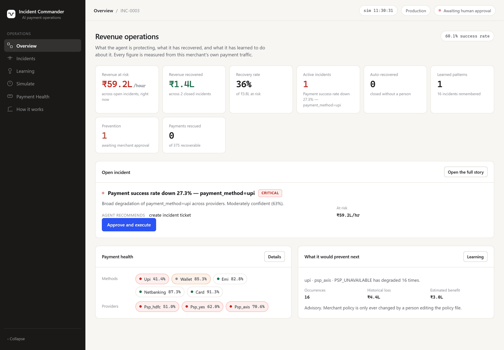

Eight cards answering, in five seconds: how much is at risk, how much came back, how much of that
was automatic, what has been learned, what could be prevented.

| Region | Comes from |
|---|---|
| The eight cards | `GET /api/metrics` → `Engine.current_metrics` |
| *Revenue recovered*, *Recovery rate* | `revenue.py::aggregate` over closed incidents |
| *Auto-recovered* | Incidents whose learning record shows `helped` and no human involvement |
| *Learned patterns* | Distinct failure signatures in memory |
| *Prevention* | `patterns.py`, status `PROPOSED` |
| The incident glance | The selected incident's typed record; the bar is `RevenueBar` |
| Payment health chips | `GET /api/health/segments` |

Rendered by `pages.jsx::CommandCenter`.

### 5.2 The incident story

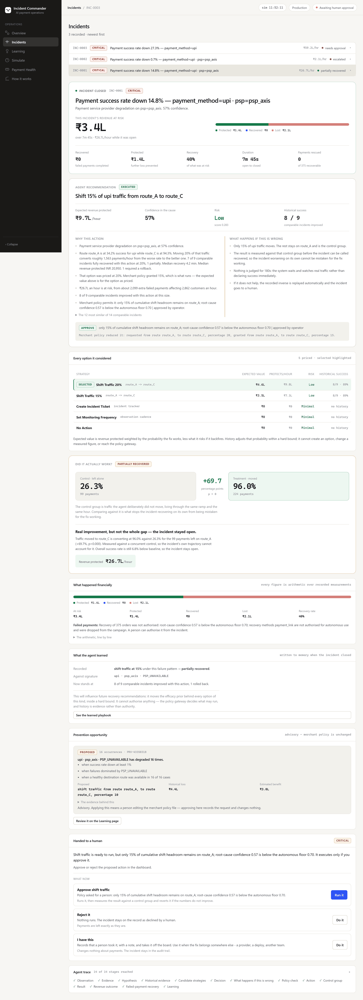

One argument, top to bottom. `web/src/Incident.jsx`.

#### The hero — what is breaking and what it costs

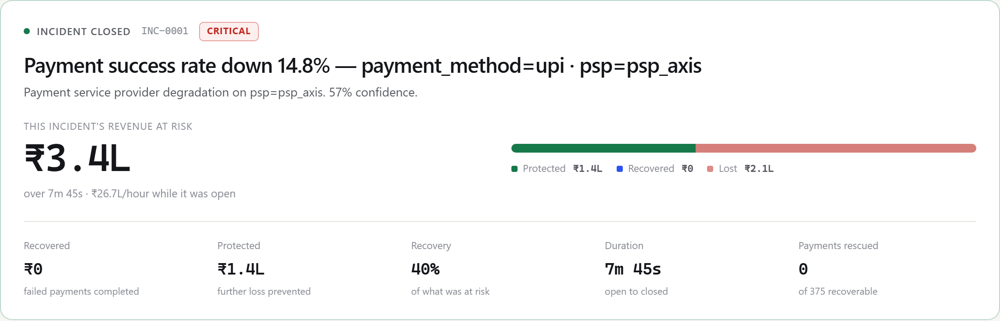

`Incident.jsx::Hero`. **This incident's** exposure, never the portfolio's — the label says which,
every time. The bar's three segments sum to the exposure exactly (`revenue.py`). Duration is on the
simulated clock, taken from `metrics.timestamp`.

#### The recommendation — the business decision

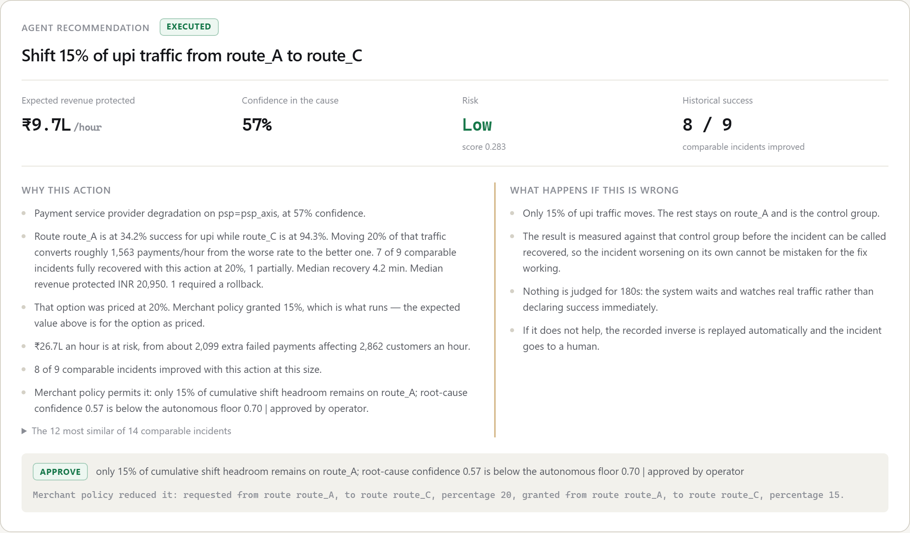

`Incident.jsx::Recommendation`, the largest thing on the page after the money.

| Region | Comes from |
|---|---|
| The action sentence | `policy_decision.granted_parameters` — what will actually run, not what was asked for |
| Expected revenue protected / confidence / risk | `ActionProposal` |
| Historical success | `RecoveryStrategy.historical_support.stats` — a count over stored records |
| *Why this action* | Root cause, the strategy's own pricing rationale, the impact figures, the history, the policy verdict |
| *What happens if this is wrong* | The `exposure` stage of `api/trace.py` — every line read off a recorded field |
| The policy line | `PolicyDecision.reason`, plus requested-versus-granted when clamped |

#### Every option it considered

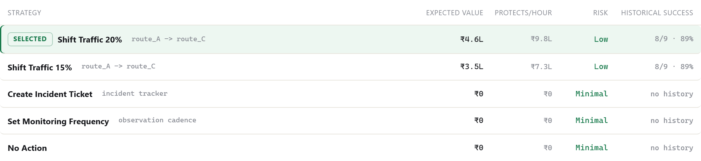

`Incident.jsx::StrategyTable`, from `RecoveryPlan.strategies`. Showing only the chosen action asks
for trust; showing what it was chosen over offers a reason. Expected value is revenue protected
weighted by the probability the fix works, less what it risks — and history adjusts that
probability within a hard bound.

#### Verification — the experiment

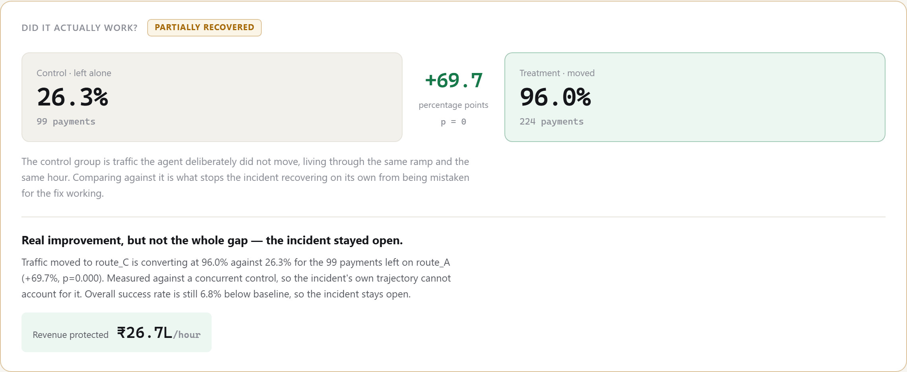

`Incident.jsx::VerificationPanel`, from `VerificationResult`. The control group is traffic the agent
deliberately did not move, living through the same ramp and the same hour. The five verdicts —
recovered, partially recovered, failed, regressed, inconclusive — are visually distinct.

#### What the agent learned

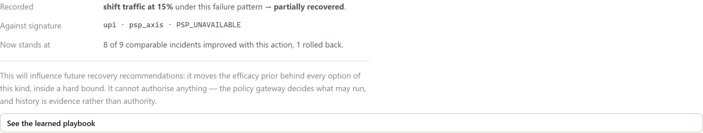

`Incident.jsx::LearnedFromThis`, from `IncidentRecord.learning` — the record written to memory at
close, and what the action's tally now stands at.

#### The agent trace, expanded

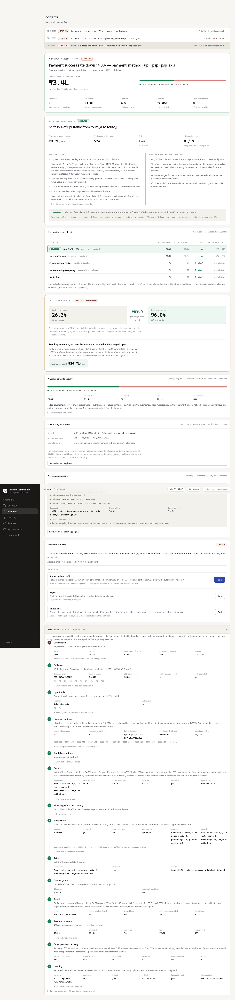

`components.jsx::DecisionTrace`, rendering `GET /api/incidents/{id}/trace`. Collapsed by default
and last on the page: it is the evidence for the story rather than the story. Every stage opens to
the findings and the tool that produced each, the hypotheses with what argues against them, the
incidents this was weighed against, every option priced, and every policy rule evaluated.

The trace is defined **once**, in Python, next to the objects it describes. A second definition in
JavaScript would drift, and the half that drifted would be the half a person is reading.

### 5.3 The safety story — a fix that did not work

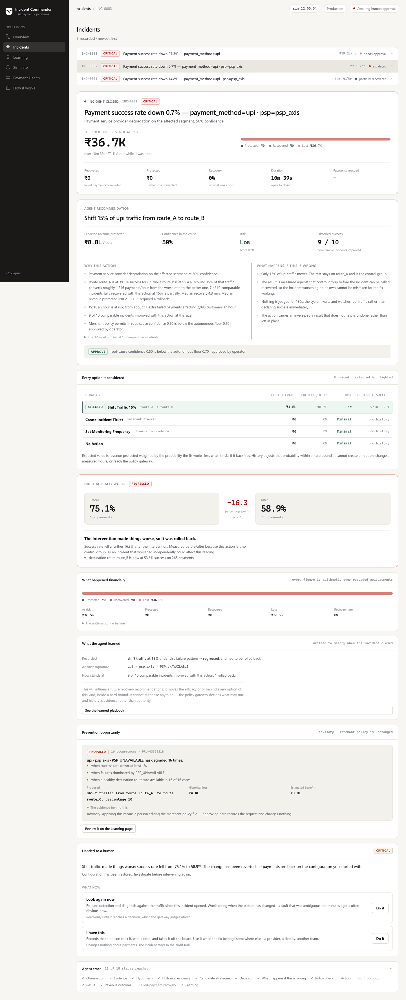

The same page for an incident where the obvious fix could not work. The agent acted, measured
against the control, found no improvement, **reverted its own change from the recorded inverse**,
and handed over — with the action it tried, the two rates it compared, and moves a human can
actually make.

### 5.4 Learning — the playbook

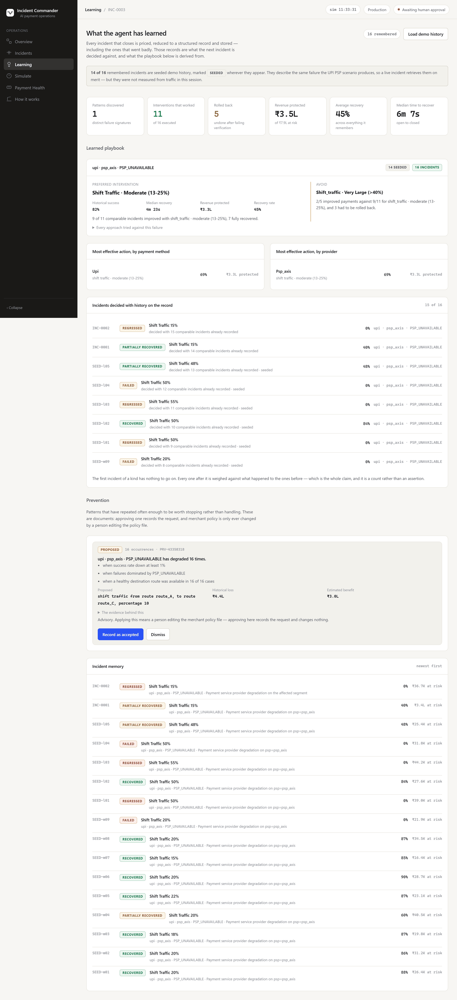

`pages.jsx::Learning`, from `GET /api/learning`.

| Region | Comes from |
|---|---|
| The seeded-history banner | `seeded_remembered` — seeded records are labelled wherever they appear |
| The six cards | `memory.get_historical_recovery_outcomes` |
| **Learned playbook** | `memory/playbook.py::build_playbook` — preferred intervention, what to avoid, and why |
| By payment method / by provider | `playbook.py::effectiveness_by` |
| Decided with history on the record | `playbook.py::influenced_by_history` |
| Prevention queue | `memory/patterns.py` |
| Incident memory | The stored `IncidentOutcomeRecord`s, newest first |

A preference is only named above three comparable incidents, and an approach is only advised
against when it is both measurably worse *and* has failed more than once.

### 5.5 Simulate

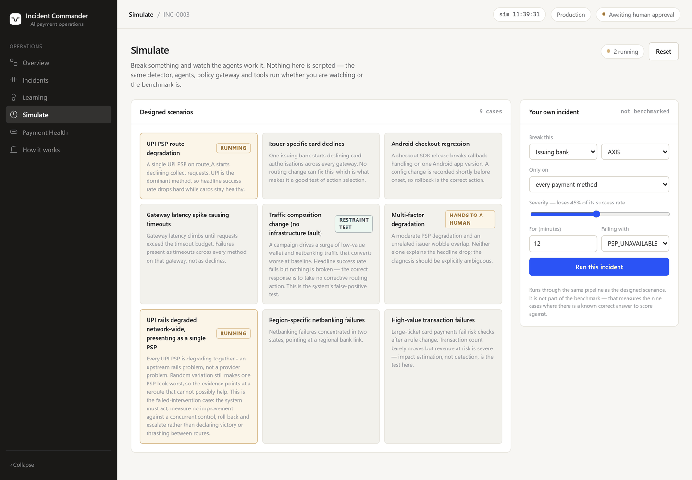

`Simulate.jsx`. Nine designed scenarios, or a degradation you describe yourself — injected into the
same simulator and handled by the same detector, agents, gateway and tools. There is no separate
path for a custom one, which is the point.

### 5.6 Payment health

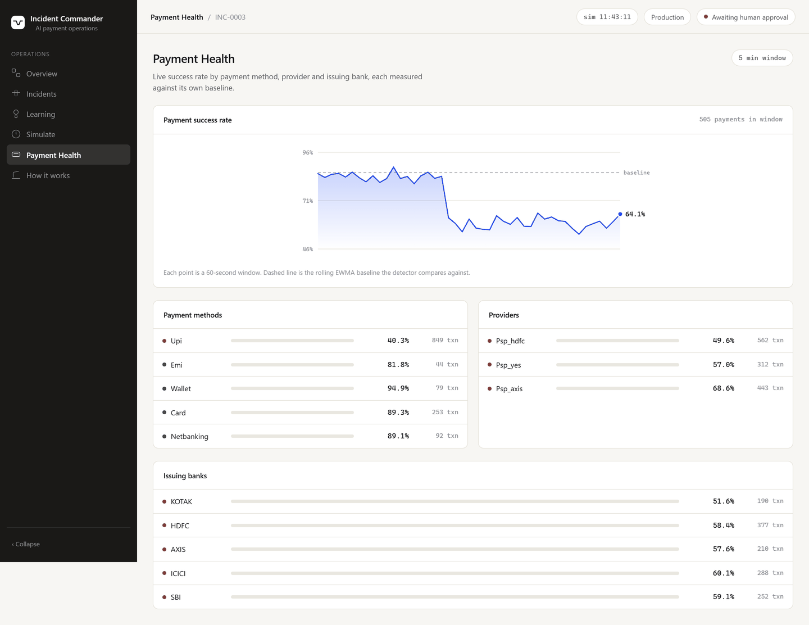

`pages.jsx::Health`, from `GET /api/health/segments`. Live success rate per method, provider and
issuer, each measured against **its own** baseline rather than a global one.

### 5.7 How it works

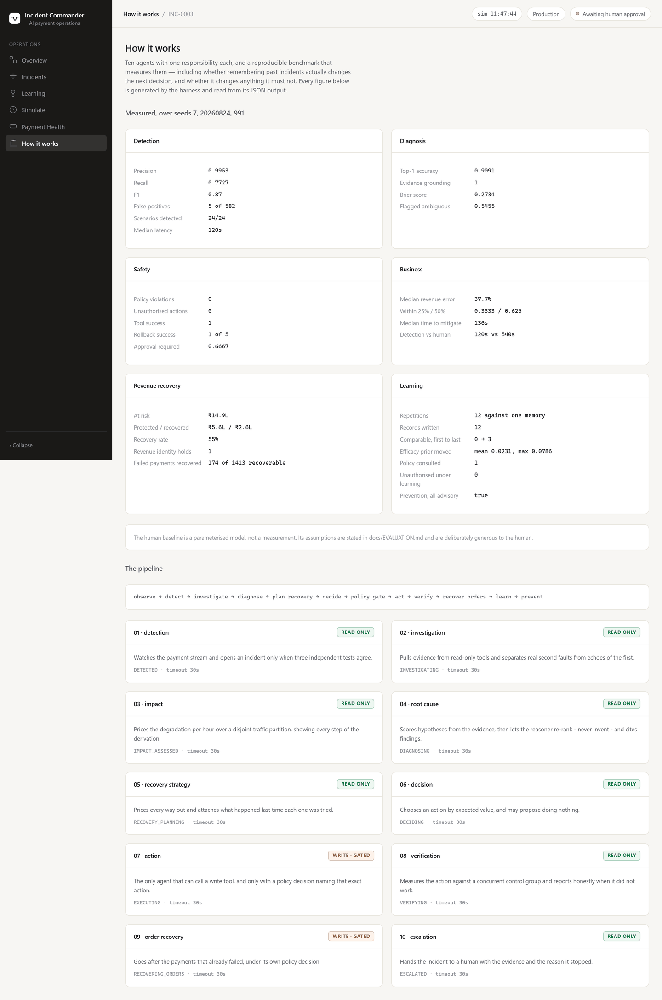

`pages.jsx::Proof`. The pipeline, and the benchmark read from `evaluation/results/latest.json`. The
dashboard never renders a number the harness did not produce.

### 5.8 The landing page

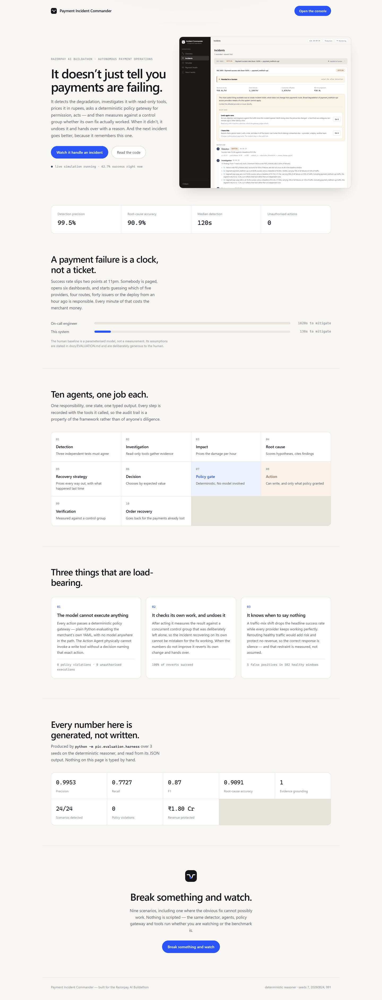

`Landing.jsx`. Shows the product before it argues for it.

---

## 6. Where the model is, and where it deliberately is not

| Concern | Implementation |
|---|---|
| Detection, attribution, impact arithmetic | Deterministic |
| Hypothesis *scoring* | Deterministic |
| Hypothesis *selection and narrative* | **Model** |
| Option generation and pricing | Deterministic |
| Historical retrieval and efficacy priors | Deterministic, hard-capped |
| Action *proposal* | **Model**, from a closed priced catalogue |
| Action *authorisation* | Deterministic. No model in the path. |
| Execution, verification, revenue, prevention | Deterministic |

Without a `GEMINI_API_KEY` the whole system runs on `llm/deterministic.py` — which is also what the
benchmark pins, so published numbers never depend on a model being reachable.

---

## 7. Running it

```bash
python -m pic.demo                  # both acts of the terminal demo
python -m pic.demo --loop           # just the closed loop
python -m pic.evaluation.harness    # the benchmark; writes evaluation/results/latest.json
python -m pytest -q                 # 146 tests

cd web && npm install && npm run build && cd ..
uvicorn pic.api.main:app --port 8000
```

Then `POST /api/demo/seed-history` (or Overview → *Load demo history*) before demonstrating
learning, so the playbook has something to have learned from.

---

## 8. Where to start reading

| To understand | Read |
|---|---|
| The whole flow | `pic/agents/supervisor.py`, from `run_incident` |
| How it is wired | `pic/engine.py` |
| Why detection is not an LLM | `pic/detection/detector.py`, then ADR-001 |
| The safety argument | `pic/policies/gateway.py` and `ToolRegistry.call`, then ADR-002 |
| How learning works, and what it cannot do | `pic/memory/store.py`, `pic/agents/strategy.py`, then ADR-010 |
| Why the money adds up | `pic/revenue.py`, then ADR-012 |
| What is actually guaranteed | `tests/test_safety_invariants.py` and the *Safety under learning* section of `tests/test_learning_and_recovery.py` |
| Whether the numbers are real | `pic/evaluation/harness.py`, then [EVALUATION](EVALUATION.md) |
